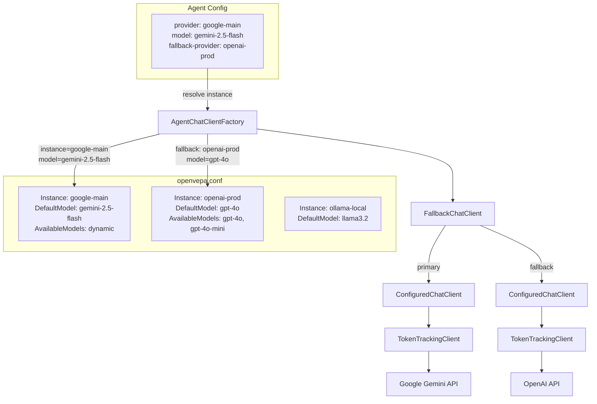

# ADR-0001: Refactor Provider Configuration to Support One-Provider-Many-Models

## Context and Problem Statement

The current OpenVEPA provider model binds one model per provider instance (`ModelId` field on `ProviderInstanceOptions`). This creates three problems:

1. A single Google Gemini subscription grants access to gemini-2.5-flash, gemini-1.5-pro, gemini-2.5-flash, etc. Today you must create a separate "instance" for each model with duplicated credentials.
2. Agents reference providers by type name (`"google"`) which is ambiguous when two Google subscriptions exist with different API keys.
3. The factory resolves instances by matching `Name` OR `Type`, creating non-deterministic behavior with multiple same-type instances.

How should the provider and agent configuration models change to support one provider instance exposing many models, with deterministic agent-to-instance binding?

## Decision Drivers

* **One provider = many models**: Users expect a single subscription entry to expose all models from that service
* **Multi-instance same type**: Two Google API keys with different rate limits or model access must coexist
* **Deterministic resolution**: Agent config must unambiguously identify both the provider instance and the specific model
* **Backward compatibility**: Existing configs with single `ModelId` must work without manual migration
* **UX simplicity**: The WebUI must present provider-then-model selection without cognitive overload
* **Audit granularity**: Usage tracking must report per-instance AND per-model

## Considered Options

* **Option A: Extend ProviderInstanceOptions with DefaultModel + AvailableModels**
* **Option B: Separate Provider and Model into distinct config sections with cross-references**
* **Option C: Flatten to per-model entries (keep current shape, accept duplication)**

## Decision Outcome

Chosen option: **Option A**, because it preserves the current instance-centric configuration shape while adding multi-model support with minimal breaking changes. The migration path is mechanical (rename `ModelId` to `DefaultModel`), and the runtime resolution logic stays in the same factory class.

### Consequences

* Good, because existing single-model configs auto-migrate with zero user action
* Good, because the factory cache key already includes model; multi-model resolution fits naturally
* Good, because the WebUI cascading dropdown (provider instance then model) maps directly to the data model
* Bad, because `AvailableModels` for dynamic providers (Ollama) requires periodic background refresh
* Bad, because the cache grows linearly with distinct (instance, model) pairs

### Confirmation

* Unit tests for `AgentChatClientFactory` covering: default model fallback, explicit model selection, cross-instance isolation, legacy config auto-migration
* Integration test: two Google instances with overlapping models resolve to correct API keys
* WebUI manual test: cascading dropdown populates models per instance

## Pros and Cons of the Options

### Option A: Extend ProviderInstanceOptions with DefaultModel + AvailableModels

Add `DefaultModel` (replaces `ModelId`) and `AvailableModels` (list, empty = dynamic fetch) to `ProviderInstanceOptions`. Agent config references instance name + model name.

* Good, because minimal structural change to existing config shape
* Good, because migration is a simple field rename with fallback logic
* Good, because AvailableModels=[] triggers dynamic model discovery (existing `ModelListProxy` code)
* Good, because cache key `instance|model|temp|tokens` already handles uniqueness
* Neutral, because empty AvailableModels requires a fetch-on-first-use or background poll strategy
* Bad, because models pinned in config can go stale if provider retires them

### Option B: Separate Provider and Model into distinct config sections

Create a `Models` section that cross-references providers by name. Agents reference a model entry, which internally resolves to a provider.

* Good, because model metadata (context window, pricing) can live alongside the model entry
* Bad, because adds a new top-level config section with cross-reference complexity
* Bad, because users must maintain two config sections in sync
* Bad, because the indirection makes the WebUI harder to implement (three-level config)

### Option C: Flatten to per-model entries

Keep current `ModelId` per instance. Users create `google-flash`, `google-pro`, `google-ultra` instances with the same API key.

* Good, because zero code changes
* Bad, because credential duplication across instances
* Bad, because API key rotation requires updating N instances
* Bad, because users with 10+ models from one provider face config explosion

## More Information

### Detailed Design

The following sections specify the exact changes to config structure, C# types, API contracts, WebUI behavior, and migration logic.

---

## 1. Data Model: Configuration Structure

### 1.1 New `openvepa.conf` Shape

```json
{
  "Providers": {
    "DefaultProvider": "google-main",
    "Instances": [
      {
        "Name": "google-main",
        "DisplayName": "Google AI (Primary)",
        "Type": "google",
        "Endpoint": "https://generativelanguage.googleapis.com/v1beta",
        "ApiKey": "AIza...",
        "DefaultModel": "gemini-2.5-flash",
        "AvailableModels": []
      },
      {
        "Name": "google-research",
        "DisplayName": "Google AI (Research Budget)",
        "Type": "google",
        "Endpoint": "https://generativelanguage.googleapis.com/v1beta",
        "ApiKey": "AIzb...",
        "DefaultModel": "gemini-1.5-pro",
        "AvailableModels": ["gemini-1.5-pro", "gemini-2.5-flash"]
      },
      {
        "Name": "ollama-local",
        "DisplayName": "Ollama (Home Server)",
        "Type": "ollama",
        "Endpoint": "http://localhost:11434",
        "DefaultModel": "llama3.2",
        "AvailableModels": []
      },
      {
        "Name": "openai-prod",
        "DisplayName": "OpenAI Production",
        "Type": "openai",
        "Endpoint": "https://api.openai.com/v1",
        "ApiKey": "sk-...",
        "DefaultModel": "gpt-4o",
        "AvailableModels": ["gpt-4o", "gpt-4o-mini", "o3-mini"]
      }
    ]
  }
}
```

**Key rules:**
- `AvailableModels: []` (empty array) = fetch dynamically from provider API on demand
- `AvailableModels: ["model-a", "model-b"]` = user-pinned list, no dynamic fetch
- `DefaultModel` is the model used when an agent specifies only the provider instance
- `DefaultProvider` references an instance `Name`, never a type

### 1.2 Legacy Config Auto-Detection

When `Instances` is null/empty but legacy sections (e.g., `Providers:Ollama`) exist, the system synthesizes instances at startup. This preserves backward compatibility.

### 1.3 Top-Level DefaultModel Removed

The current `ProviderOptions.DefaultModel` is redundant once each instance has its own `DefaultModel`. Remove it. The system default model is `Instances[DefaultProvider].DefaultModel`.

---

## 2. C# Type Changes

### 2.1 ProviderInstanceOptions (Modified)

File: `src/OpenVEPA.Providers/ProviderOptions.cs`

```csharp
public sealed class ProviderInstanceOptions
{
    /// <summary>Unique instance identifier (e.g., "google-main").</summary>
    public string Name { get; set; } = "";

    /// <summary>User-friendly display name.</summary>
    public string DisplayName { get; set; } = "";

    /// <summary>Provider type (e.g., "ollama", "google", "openai").</summary>
    public string Type { get; set; } = "";

    /// <summary>API endpoint URL.</summary>
    public string? Endpoint { get; set; }

    /// <summary>
    /// Default model for this instance. Used when an agent references
    /// this provider without specifying a model.
    /// </summary>
    public string DefaultModel { get; set; } = "";

    /// <summary>
    /// Explicit list of available models. Empty list = fetch dynamically
    /// from the provider's model listing API.
    /// </summary>
    public List<string> AvailableModels { get; set; } = [];

    /// <summary>API key (optional, not required for Ollama).</summary>
    public string? ApiKey { get; set; }

    // --- Backward compatibility ---

    /// <summary>
    /// Legacy field. Mapped to DefaultModel during deserialization.
    /// Ignored when DefaultModel is set.
    /// </summary>
    [Obsolete("Use DefaultModel instead. This field exists for backward compatibility.")]
    public string? ModelId
    {
        get => null;
        set
        {
            if (!string.IsNullOrWhiteSpace(value) && string.IsNullOrWhiteSpace(DefaultModel))
                DefaultModel = value;
        }
    }
}
```

### 2.2 ProviderOptions (Modified)

```csharp
public sealed class ProviderOptions
{
    /// <summary>
    /// The Name of the default provider instance.
    /// Must reference an entry in Instances by Name.
    /// </summary>
    public string DefaultProvider { get; set; } = "ollama";

    /// <summary>Named provider instances.</summary>
    public List<ProviderInstanceOptions> Instances { get; set; } = [];

    // --- Legacy properties for backward compatibility ---
    public OpenAiOptions? OpenAi { get; set; }
    public OllamaOptions? Ollama { get; set; }
}
```

Note: `DefaultModel` property removed from `ProviderOptions`. Each instance owns its default.

### 2.3 AgentLlmConfig (Modified)

File: `src/OpenVEPA.Core/Agents/AgentLlmConfig.cs`

```csharp
/// <summary>Per-agent LLM configuration override. Null fields fall back to system defaults.</summary>
public sealed record AgentLlmConfig(
    /// <summary>
    /// Provider instance name (e.g., "google-main", "ollama-local").
    /// References ProviderInstanceOptions.Name. Null = use system default instance.
    /// </summary>
    string? Provider = null,

    /// <summary>
    /// Specific model from the provider instance (e.g., "gemini-2.5-flash").
    /// Must be in the instance's AvailableModels or dynamically available.
    /// Null = use the instance's DefaultModel.
    /// </summary>
    string? Model = null,

    /// <summary>Sampling temperature (0.0 - 2.0).</summary>
    double? Temperature = null,

    /// <summary>Maximum response tokens.</summary>
    int? MaxTokens = null,

    /// <summary>
    /// Fallback provider instance name. Used when the primary provider fails.
    /// Null = no fallback.
    /// </summary>
    string? FallbackProvider = null,

    /// <summary>
    /// Fallback model. Null = use the fallback provider's DefaultModel.
    /// </summary>
    string? FallbackModel = null);
```

**Semantic change**: `Provider` now means instance name, not provider type. Agent markdown example:

```yaml
openvepa-llm:
  provider: google-main          # Instance name, not "google"
  model: gemini-2.5-flash        # Specific model from that instance
  temperature: 0.3
  max-tokens: 8192
  fallback-provider: openai-prod
  fallback-model: gpt-4o-mini
```

---

## 3. Factory Resolution Changes

### 3.1 AgentChatClientFactory Changes

File: `src/OpenVEPA.Providers/AgentChatClientFactory.cs`

**Current problem**: `CreateClientForProvider` matches by Name OR Type. With multi-instance same type, Type matching is non-deterministic.

**New resolution algorithm**:

```
1. Extract instanceName = config.Provider ?? options.DefaultProvider
2. Find instance = Instances.First(i => i.Name == instanceName)
3. If not found, throw InvalidOperationException (no silent fallback to type)
4. Extract modelId = config.Model ?? instance.DefaultModel
5. Create base client using instance credentials + modelId
6. Apply temperature/maxTokens overrides via ConfiguredChatClient
7. If config.FallbackProvider is set, wrap with FallbackChatClient
```

**Cache key change**: `"{instanceName}|{modelId}|{temperature}|{maxTokens}"`

The `||` Type fallback in line 88 of `AgentChatClientFactory.cs` is removed. Resolution is by instance Name only.

### 3.2 CreateFromInstance Signature Change

`CreateFromInstance` currently receives the full `ProviderInstanceOptions` and reads `ModelId` from it. The new signature accepts an explicit `modelId` parameter:

```csharp
internal static IChatClient CreateFromInstance(
    ProviderInstanceOptions instance,
    string modelId,
    Func<LlmAuditLogEntry, Task>? auditLogger)
```

This allows the factory to create a client for any model from the instance, not just `DefaultModel`.

### 3.3 FallbackChatClient Integration

When `AgentLlmConfig.FallbackProvider` is set, the factory wraps the primary client:

```csharp
var primary = CreateClientForInstance(primaryInstance, primaryModel);
var fallback = CreateClientForInstance(fallbackInstance, fallbackModel);
return new FallbackChatClient(primary, fallback, logger);
```

---

## 4. API Contract Changes

### 4.1 GET /api/system/llm-config Response

```csharp
// Before
internal sealed record LlmProviderEntry(
    string Name, string DisplayName, string Type,
    string ModelId, string? Endpoint);

// After
internal sealed record LlmProviderEntry(
    string Name,
    string DisplayName,
    string Type,
    string DefaultModel,
    IReadOnlyList<string> AvailableModels,
    string? Endpoint,
    bool SupportsModelListing);
```

### 4.2 PUT /api/system/llm-config Request

```csharp
// Before
internal sealed record ProviderConfigInput
{
    public string? Name { get; init; }
    public string? DisplayName { get; init; }
    public string? Type { get; init; }
    public string? ModelId { get; init; }
    public string? Endpoint { get; init; }
    public string? ApiKey { get; init; }
}

// After
internal sealed record ProviderConfigInput
{
    public string? Name { get; init; }
    public string? DisplayName { get; init; }
    public string? Type { get; init; }
    public string? DefaultModel { get; init; }
    public List<string>? AvailableModels { get; init; }
    public string? Endpoint { get; init; }
    public string? ApiKey { get; init; }

    // Backward compat: accept ModelId, map to DefaultModel
    public string? ModelId { get; init; }
}
```

### 4.3 GET /api/system/models (Modified)

Currently accepts `?provider=google&apiKey=...&endpoint=...` query params.

**New**: Also accept `?instance=google-main` to resolve credentials from config:

```
GET /api/system/models?instance=google-main
```

Server looks up the instance by name, uses its stored API key and endpoint, fetches models. This avoids sending API keys from the browser.

### 4.4 GET /api/system/llm-usage Response (Enhanced)

Add per-model breakdown within provider:

```csharp
internal sealed record LlmUsageDetailResponse(
    DateTimeOffset? Since,
    int TotalCallCount,
    long TotalInputTokens,
    long TotalOutputTokens,
    decimal TotalCostUsd,
    IReadOnlyList<ProviderUsageEntry> ByProvider);

internal sealed record ProviderUsageEntry(
    string ProviderInstance,
    string ProviderType,
    int CallCount,
    long InputTokens,
    long OutputTokens,
    decimal CostUsd,
    IReadOnlyList<ModelUsageEntry> ByModel);

internal sealed record ModelUsageEntry(
    string Model,
    int CallCount,
    long InputTokens,
    long OutputTokens,
    decimal CostUsd);
```

### 4.5 PUT /api/agents/{name}/config

No structural change needed. `AgentLlmConfig` already has `Provider` and `Model` fields. The semantic change (Provider = instance name) is transparent to the API shape.

**New validation**: When saving agent config, verify `Provider` matches a known instance name. Verify `Model` is in that instance's available models (or allow any model if AvailableModels is empty/dynamic).

---

## 5. WebUI UX Design

### 5.1 LLM Settings Page (`/#/llm-settings`)

```
+----------------------------------------------------------+
| LLM Providers                                    [+ Add] |
+----------------------------------------------------------+
|                                                          |
| +--- google-main -------------------+ [DEFAULT] [Edit]  |
| | Google AI (Primary)               |           [Remove] |
| | Type: google                      |                    |
| | Default Model: gemini-2.5-flash   |                    |
| | Models: (dynamic - 12 available)  |                    |
| +-----------------------------------+                    |
|                                                          |
| +--- openai-prod -------------------+           [Edit]  |
| | OpenAI Production                 |           [Remove] |
| | Type: openai                      |                    |
| | Default Model: gpt-4o            |                    |
| | Models: gpt-4o, gpt-4o-mini, o3  |                    |
| +-----------------------------------+                    |
|                                                          |
| +--- ollama-local ------------------+           [Edit]  |
| | Ollama (Home Server)              |           [Remove] |
| | Type: ollama                      |                    |
| | Default Model: llama3.2          |                    |
| | Models: (dynamic - 5 available)   |                    |
| +-----------------------------------+                    |
+----------------------------------------------------------+
```

**Provider card details:**
- Show instance name, display name, type badge, default model
- "Models: (dynamic - N available)" when AvailableModels is empty (fetched on expand)
- "Models: model-a, model-b, model-c" when user has pinned models
- Click card to expand: shows full model list with radio button for default

**Edit Provider Dialog:**
- Same fields as today plus:
  - "Default Model" dropdown (populated from available models)
  - "Available Models" section: toggle between "Fetch dynamically" and "Pin specific models"
  - When pinning, show checkboxes from the fetched list

### 5.2 Agent Config Page

```
+----------------------------------------------------------+
| Agent: research                                          |
+----------------------------------------------------------+
| LLM Configuration                                        |
|                                                          |
| Provider Instance:  [ google-main          v ]           |
| Model:              [ gemini-2.5-flash     v ]           |
| Temperature:        [ 0.3                    ]           |
| Max Tokens:         [ 8192                   ]           |
|                                                          |
| Fallback (optional)                                      |
| Fallback Provider:  [ openai-prod          v ]           |
| Fallback Model:     [ gpt-4o-mini         v ]           |
+----------------------------------------------------------+
```

**Cascading dropdown behavior:**
1. "Provider Instance" dropdown lists all configured instances by DisplayName
2. Selecting an instance triggers model list population:
   - If AvailableModels is pinned: populate from config
   - If AvailableModels is empty: call `GET /api/system/models?instance={name}` and cache
3. "Model" dropdown shows "(instance default)" as first option, then available models
4. Same cascade for fallback provider/model

### 5.3 Usage Page

Group by provider instance, then by model:

```
+----------------------------------------------------------+
| LLM Usage (Last 30 days)                                 |
+----------------------------------------------------------+
| google-main                           Total: $12.47      |
|   gemini-2.5-flash    4,231 calls    $3.21              |
|   gemini-2.5-flash    1,892 calls    $9.26              |
|                                                          |
| openai-prod                           Total: $8.93      |
|   gpt-4o              312 calls      $7.80              |
|   gpt-4o-mini         1,456 calls    $1.13              |
|                                                          |
| ollama-local                          Total: $0.00      |
|   llama3.2            8,721 calls    $0.00              |
+----------------------------------------------------------+
```

---

## 6. Migration Strategy

### 6.1 Config File Migration (Zero-Touch)

**Trigger**: On first startup after upgrade, when `ProviderOptions` deserialization detects:
- `Instances` is null/empty AND legacy sections exist, OR
- Any instance has `ModelId` set but `DefaultModel` is empty

**Legacy section migration** (already partially implemented in `SystemApiExtensions`):

```
Providers:Ollama:ModelId=llama3.2  -->  Instance { Name="ollama", Type="ollama",
                                                    DefaultModel="llama3.2",
                                                    AvailableModels=[] }
```

**ModelId to DefaultModel migration**:

```
Instance { ModelId="gpt-4o" }  -->  Instance { DefaultModel="gpt-4o",
                                                AvailableModels=[] }
```

The `ModelId` setter on `ProviderInstanceOptions` handles this transparently.

### 6.2 Agent Config Migration

**Current agent configs** use `provider: google` (type name).

**Migration path**: If `Provider` value does not match any instance Name but matches an instance Type, find the first instance of that type and rewrite the agent config to use the instance Name. Log a warning.

**In `AgentChatClientFactory.CreateClientForProvider`**:

```csharp
// Step 1: Exact match by Name
var instance = options.Instances.FirstOrDefault(
    i => string.Equals(i.Name, providerKey, StringComparison.OrdinalIgnoreCase));

// Step 2: Compat fallback - match by Type (log deprecation warning)
if (instance is null)
{
    instance = options.Instances.FirstOrDefault(
        i => string.Equals(i.Type, providerKey, StringComparison.OrdinalIgnoreCase));
    if (instance is not null)
    {
        _logger.LogWarning(
            "Agent references provider by type '{Type}' instead of instance name '{Name}'. "
            + "Update agent config to use instance name.",
            providerKey, instance.Name);
    }
}
```

This fallback can be removed in a future release.

### 6.3 API Backward Compatibility

The PUT endpoint accepts both `ModelId` and `DefaultModel` in `ProviderConfigInput`. If both are set, `DefaultModel` wins. This handles older UI clients sending `ModelId`.

---

## 7. File Change Summary

| File | Change Type | Description |
|------|-------------|-------------|
| `src/OpenVEPA.Providers/ProviderOptions.cs` | **Modify** | Add `DefaultModel`, `AvailableModels` to `ProviderInstanceOptions`. Add `[Obsolete] ModelId` compat setter. Remove `DefaultModel` from `ProviderOptions`. |
| `src/OpenVEPA.Core/Agents/AgentLlmConfig.cs` | **Modify** | Add `FallbackProvider`, `FallbackModel` parameters. Update XML docs for `Provider` semantic change. |
| `src/OpenVEPA.Providers/AgentChatClientFactory.cs` | **Modify** | Remove Type-based fallback in `CreateClientForProvider`. Pass explicit model to `CreateFromInstance`. Add deprecation-warning compat path. Integrate `FallbackChatClient`. |
| `src/OpenVEPA.Providers/ProviderServiceExtensions.cs` | **Modify** | Change `CreateFromInstance` signature to accept `string modelId`. Update all callers. |
| `src/OpenVEPA.Server/Api/SystemApiExtensions.cs` | **Modify** | Update `LlmProviderEntry` record. Update `ProviderConfigInput`. Add instance-based model fetch. Update validation to check `DefaultModel`. Add per-model usage breakdown. |
| `src/OpenVEPA.Server/DashboardPageHtml.cs` | **Modify** | Cascading dropdowns on agent config. Provider cards showing model list. Usage page grouped by instance+model. |
| `src/OpenVEPA.Agents.Runtime/AgentMdParser.cs` | **Modify** | Parse `fallback-provider` and `fallback-model` from agent YAML. |
| `src/OpenVEPA.Storage/SqliteLlmAuditLogger.cs` | **Verify** | Already logs provider + model per call. No change needed if fields map correctly. |
| `src/OpenVEPA.Providers/OllamaProvider.cs` | **Modify** | Accept model as parameter (already does via `OllamaOptions.Model`). No structural change. |
| `src/OpenVEPA.Providers/OpenAiProvider.cs` | **Modify** | Accept model as parameter (already does via `OpenAiOptions.Model`). No structural change. |

---

## 8. Architecture Diagram



---

## 9. Risks and Mitigations

| Risk | Likelihood | Impact | Mitigation |
|------|-----------|--------|------------|
| Dynamic model fetch fails (network error, API change) | Medium | Low | Fall back to DefaultModel only. Cache last-known model list for 24h. |
| Agent references model not in AvailableModels | Low | Medium | Allow any model string through to the API. Provider will reject invalid models with a clear error. Validate only when AvailableModels is pinned. |
| Cache grows unbounded with many agent+model combos | Low | Low | Cache entries are lightweight (one IChatClient wrapper). Add optional LRU eviction at 1000 entries. |
| Legacy `provider: google` agent configs break | High | High | Compat fallback by Type with deprecation warning (see Section 6.2). Remove in v2. |

---

## Reversibility Assessment

- [x] **Rollback capability**: `DefaultModel` can be renamed back to `ModelId` without data loss. The `[Obsolete] ModelId` setter provides bidirectional compat.
- [x] **Vendor lock-in**: No new vendor dependencies introduced. All providers use existing SDKs.
- [x] **Exit strategy**: N/A (internal architecture change, no external dependencies added).
- [x] **Legacy impact**: Full backward compat via ModelId setter and Type-based resolution fallback.
- [x] **Data migration**: Config changes are additive. Audit log schema unchanged.
